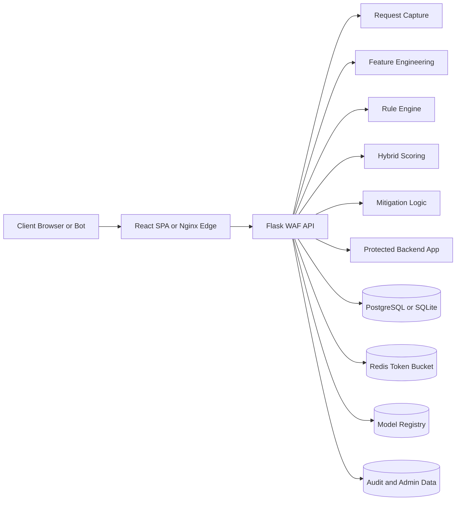
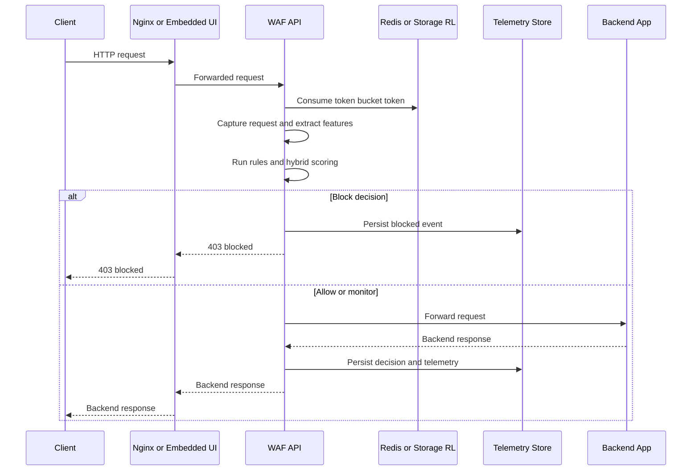
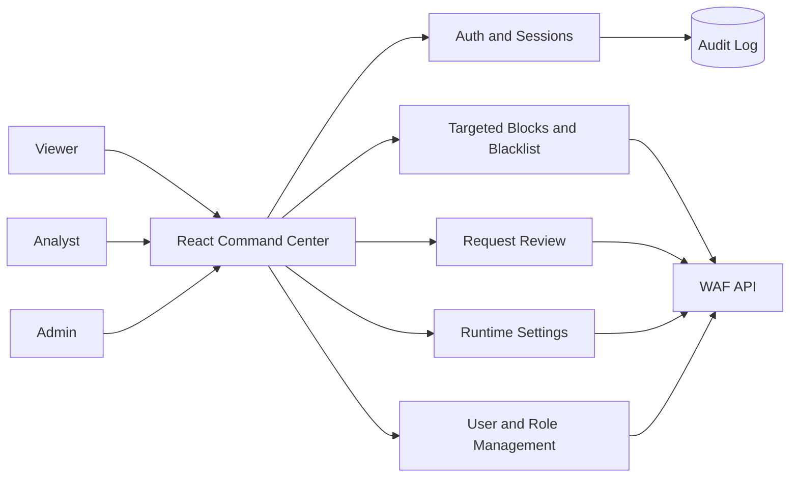
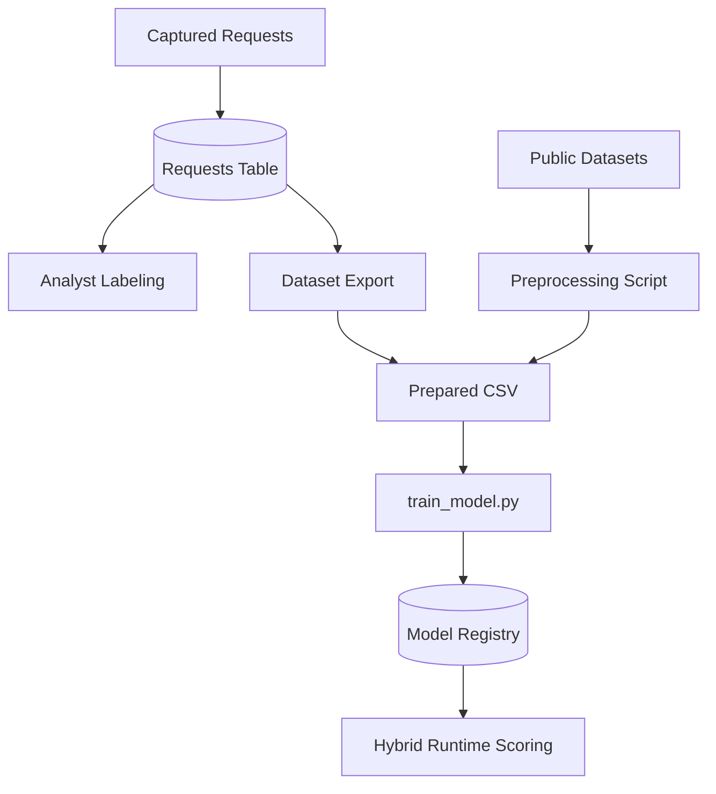
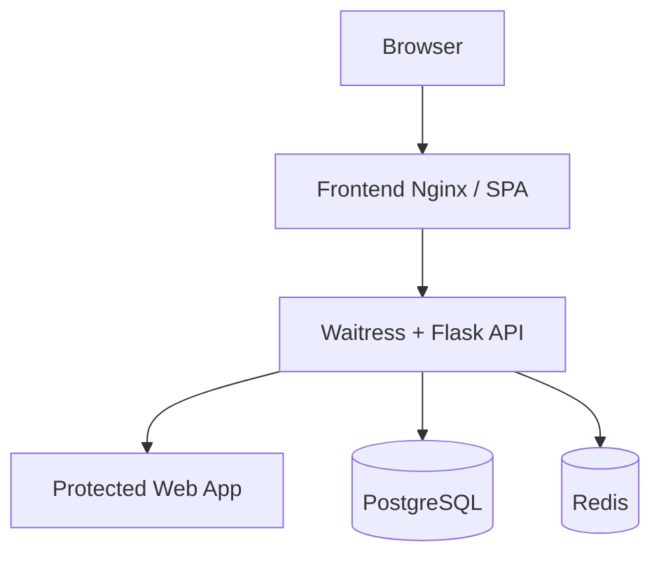

# System Architecture

## High-level component view

## Request processing sequence

## Control-plane and analyst workflow

## ML and data lifecycle

## Deployment topology

## Security decisions

- High-confidence signatures are blocked immediately.
- Hybrid scoring combines behavioral features and ML output.
- Analysts can apply targeted blocks by signature, path, session, or IP.
- Admin actions are audited and tied to authenticated roles.
- Redis-backed rate limiting is used for multi-instance deployments, while storage-backed token buckets remain available as fallback.
- The separated deployment mode uses React as a dedicated SPA and Flask as an API-only backend, while the local mode can still embed the dashboard directly.
